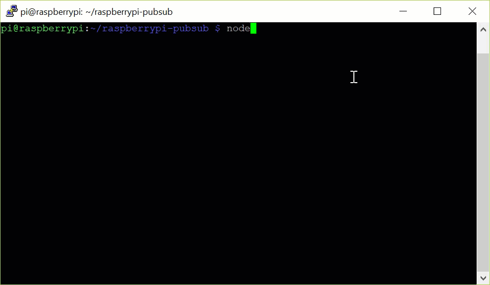

# IOTA Raspberry Pi Demo

This application allows you to use one command to start sending sensor data (the current temperature in Celsius) to the Devnet Tangle.
For now this program just can publish to tangle.

## Prerequisites

To use this demo, you need the following:

* Raspberry Pi Virtual Machine

* [An LTS version or the latest version of Node.js and NPM](https://nodejs.org/en/download/)

* [Git](https://git-scm.com/download/linux)

For help setting up a Raspberry Pi, you can follow [these instructions](https://medium.com/@lambtho/raspberry-setup-dcb23e8ba88).

## Run the application

1. Clone this repository

  ```
  git clone https://github.com/vincentsanjaya/raspberrypi_iota
  ```
2. Change into the `raspberrypi-pubsub` directory

  ```bash
  cd raspberrypi-pubsub
  ```
3. Install the dependencies

  ```bash
  npm install
  ```
4. Run the code

  ```bash
  node index.js
  ```


 
**Note:** To check that your transaction is on the Devnet Tangle, you can copy the value of the `hash` field and paste it into the search bar of the [Devnet explorer](https://devnet.thetangle.org/).
 


The `message` field contains the temperature data in trytes. To convert the trytes to ASCII characters, use one of the converter functions in the client libraries.

[Learn how to convert data between trytes and ASCII characters](https://docs.iota.org/docs/iota-basics/0.1/how-to-guides/convert-data-to-trytes).

### Response

```bash
Starting app
Current temp: just testing
Sending transaction
Transfer successfully sent
```

References:
https://github.com/iota-community/raspberrypi-pubsub
